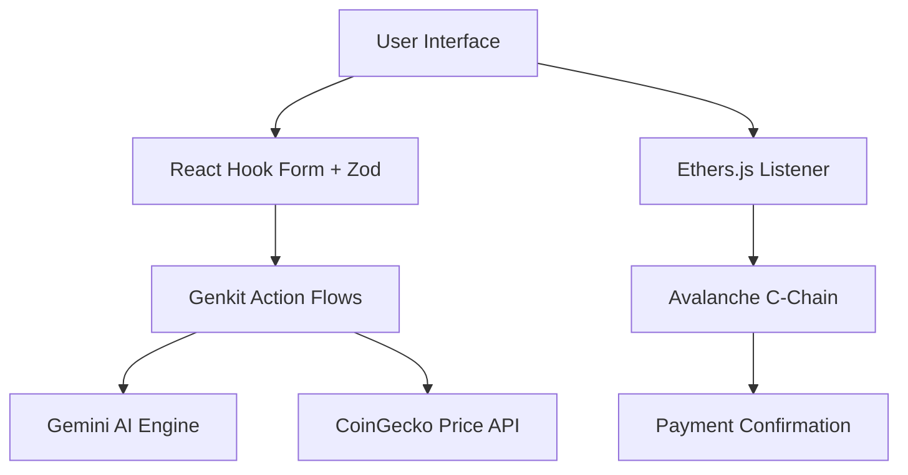

# ⚡ VelocityPay | Next-Gen Crypto Payment Gateway

> **The ultimate bridge between high-speed Avalanche blockchain and real-world merchant requirements.** 

VelocityPay is a premium, AI-powered crypto payment gateway designed for sub-second finality and zero-friction checkout experiences. Built on the Avalanche C-Chain, it leverages **Core Wallet deep-linking** and **Google’s Gemini AI** to provide a state-of-the-art payment solution for modern merchants and savvy crypto users.

---

## 🚀 Key Features

### 💎 Precision & Speed
- **Sub-Second Finality**: Powered by the Avalanche Consensus, transactions settle almost instantly with fees consistently under $0.02.
- **One-Tap Checkout**: Elimination of extension friction via mobile-optimized `ethereum:` deep-linking for Core Wallet.
- **Dynamic QR Generation**: Intelligent QR codes that encode exact transaction parameters (address, chain ID, and value).

### 🤖 Intelligent Insights
- **Powered by Gemini**: Every payment link is accompanied by real-time, AI-generated insights about the selected asset (AVAX or BTC).
- **Live USDC Estimates**: Real-time price oracle integration with CoinGecko via custom Genkit flows to provide merchants with accurate dollar valuations.

### 🎨 Premium Experience
- **Glassmorphism UI**: A stunning, responsive interface featuring interactive backdrop-blurs, radial cursor gradients, and sleek transitions.
- **Real-Time Monitoring**: Sophisticated `ethers.js` event listeners that provide instant visual feedback the moment a transaction is broadcast to the network.

---

## 🛠 Technology Stack

| Layer | Technologies |
| :--- | :--- |
| **Frontend** | [Next.js 15](https://nextjs.org/), [Tailwind CSS](https://tailwindcss.com/) |
| **Blockchain** | [Ethers.js v5](https://ethers.io/), Avalanche C-Chain |
| **AI/ML** | [Firebase Genkit](https://firebase.google.com/docs/genkit), Google Gemini |
| **UI Components**| [Shadcn UI](https://ui.shadcn.com/), [Radix UI](https://www.radix-ui.com/) |
| **State/Forms** | [Zod](https://zod.dev/), [React Hook Form](https://react-hook-form.com/) |

---

## 📂 Project Architecture

VelocityPay follows a robust, modular architecture designed for scalability and speed:



---

## 🔌 Getting Started

### Prerequisites
- Node.js (v18+)
- Local `.env` file with `GEMINI_API_KEY`
- A Core Wallet or Meta-Mask account

### Installation
1. **Clone & Enter**:
   ```bash
   git clone https://github.com/varshini-botla/velocity-pay.git
   cd velocity-pay
   ```
2. **Install Dependencies**:
   ```bash
   npm install
   ```
3. **Configure Environment**:
   ```env
   GEMINI_API_KEY=your_key_here
   ```
4. **Launch Development**:
   ```bash
   npm run dev
   ```

---

## 🛰 Roadmap

- [ ] **Multi-Token Support**: Support for any ERC-20 on Avalanche.
- [ ] **Merchant Dashboard**: View transaction history and aggregate revenue analytics.
- [ ] **Automatic Swaps**: Direct integration with Trader Joe for automatic conversion to USDC.
- [ ] **Email Receipts**: Automated PDF receipt generation post-confirmation.

---

## 👤 Author

**Varshini Botla**  
*Full Stack Developer & Blockchain Enthusiast*

[](https://github.com/varshini-botla)

---

> [!TIP]
> **Pro Tip**: Use the **Core Wallet** on mobile for the most seamless "One-Tap" experience. VelocityPay detects your device and automatically formats links for the best native experience.
